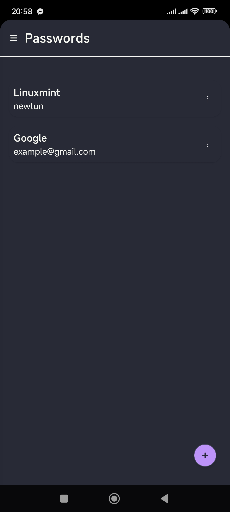
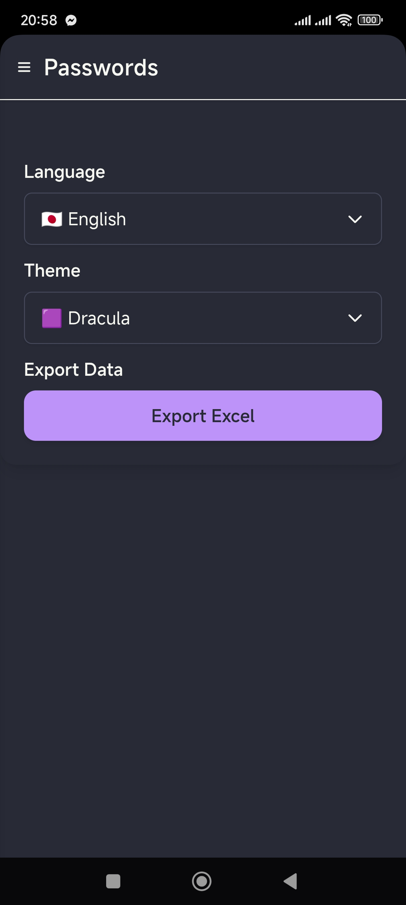
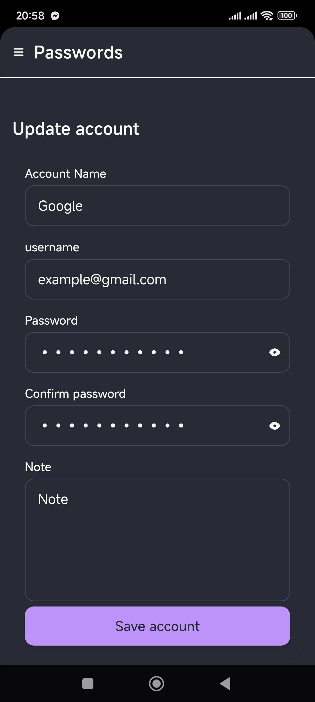

# 🔐 My Password Manager

A secure, serverless **password manager** built with **Rust**, **Tauri**, **Angular**, and **Tailwind**, using **Google Sheets API** as your personal storage.  
All your data stays private — stored only in your Google Drive. No centralized server is involved.

---

## 🚀 Features

-   🔑 **Store passwords securely** in Google Sheets
-   🛡️ **No central server** — your data is always on your own Drive
-   🔒 **Local passcode protection** for accessing the app
-   💻 **Cross-platform desktop app** (Windows, macOS, Linux) via Tauri
-   🎨 **Modern UI** built with Angular & Tailwind

---

## 🛠️ Tech Stack

-   **Rust & Tauri** – backend & desktop integration
-   **Angular** – frontend framework
-   **Tailwind CSS** – styling & responsive design
-   **Google Sheets API** – data storage

---

## ⚙️ Setup Google API

1. Go to [Google Cloud Console](https://console.cloud.google.com/).
2. Create a new project.
3. Enable **Google Sheets API** for your project.
4. Create **OAuth 2.0 Client ID** credentials:
    - Application type: **Desktop app**
    - Download the `credentials.json` file.
5. Save `credentials.json` in the app's config folder.

> Make sure the Google account you use has a dedicated sheet for storing your passwords.

---

## 📝 Usage

1. Launch the app.
2. Connect with your Google account using OAuth.
3. Select or create a **Google Sheet** to store passwords.
4. Set your **local passcode**.
5. Start adding, editing, and managing your passwords securely.

---

## 📂 Data Storage

-   Passwords & notes → Stored in **Google Sheet**
-   Passcode → Stored locally on your machine

> All sensitive data stays under your control.

---

## 🎨 UI Preview

  
  
  

---

## 📖 License

MIT License – feel free to use and modify!

---

## 💡 Tips

-   Regularly backup your Google Sheet.
-   Use a strong local passcode.
-   Only share your Sheet with trusted accounts if needed.

---
